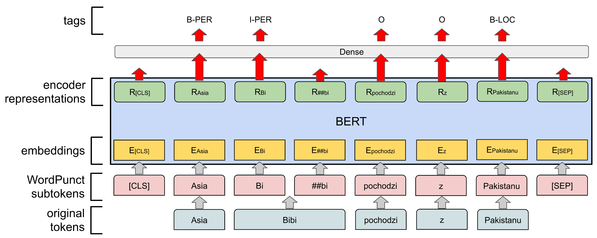

# Slavic BERT NER

***Notice:** The repo is left as-is, the Slavic BERT model is now as part of [DeepPavlov repo](https://github.com/deepmipt/DeepPavlov).*

**BERT** is a method of pre-training language representations, meaning that we train a general-purpose "language understanding" model on a large text corpus (like Wikipedia), and then use that model for downstream NLP tasks that we care about (like question answering). For details see original [BERT github](https://github.com/google-research/bert).

The repository contains **Bulgarian**+**Czech**+**Polish**+**Russian** specific:
- [shared BERT model](#slavic-bert)
- [NER model (`PER`, `LOC`, `ORG`, `PRO`, `EVT`)](#slavic-bert)

Our academic paper which describes tuning Transformers for NER task in detail can be found here: https://www.aclweb.org/anthology/W19-3712/.

## Slavic BERT

The Slavic model is the result of transfer from `2018_11_23/multi_cased_L-12_H-768_A-12` Multilingual BERT model to languages of Bulgarian (`bg`), Czech (`cs`), Polish (`pl`) and Russian (`ru`). The fine-tuning was performed with a stratified dataset of `bg`, `cs` and `pl` Wikipedias and `ru` news.

The model format is the same as in the original repository.

*   **[`BERT, Slavic Cased`](http://files.deeppavlov.ai/deeppavlov_data/bg_cs_pl_ru_cased_L-12_H-768_A-12.tar.gz)**:
    4 languages, 12-layer, 768-hidden, 12-heads, 110M parameters, 600Mb

## Slavic NER

Named Entity Recognition (further, **NER**) is a task of recognizing named entities in text, as well as detecting their type.

We used Slavic BERT model as a base to build NER system. First, we feed each input word into WordPiece case-sensitive tokenizer and extract the final hidden representation corresponding to the first subtoken in each word. These representations are fed into a classification dense layer over the NER label set. A token-level CRF layer is also added on top.



The model was trained on [BSNLP-2019 dataset](http://bsnlp.cs.helsinki.fi/shared_task.html). The pre-trained model can recognize such entities as:

- Persons (PER)
- Locations (LOC)
- Organizations (ORG)
- Products (PRO)
- Events (EVT)

The metrics for all languages and entities on test set are:

| Language     | Tag  | Precision     | Recall       | RPM (Relaxed Partial Matching)    |
|--------------|:----:|:-------------:|:------------:|:---------------------------------:|
| cs           |      | 94.3          | 93.4         | 93.9                              |
| ru           |      | 88.1          | 86.6         | 87.3                              |
| bg           |      | 90.3          | 84.3         | 87.2                              |
| pl           |      | 93.3          | 93.0         | 93.2                              |
|              | PER  | 94.2          | 95.6         | 94.9                              |
|              | LOC  | 96.6          | 96.4         | 96.5                              |
|              | ORG  | 84.3          | 92.1         | 88.0                              |
|              | PRO  | 87.6          | 51.3         | 64.7                              |
|              | EVT  | 39.4          | 27.7         | 93.9                              |
|              |      | **89.8**      | **91.8**     | **90.8**                          |

For detailed description of evaluation method see [BSNLP-2019 Shared Task page](http://bsnlp.cs.helsinki.fi/shared_task.html).

*   **[`NER, Slavic Cased`](http://files.deeppavlov.ai/deeppavlov_data/ner_bert_slav.tar.gz)**:
    4 languages, 13-layer + CRF, 768-hidden, 2.0Gb
    
# Usage

#### Install

The toolkit is implemented in Python 3.6 and requires a number of packages. To install all needed packages use:

```bash
$ pip3 install -r requirements.txt
```

CAUTION: Python3.5 and Python3.7 are not supported, see [DeepPavlov rep](https://github.com/deepmipt/deeppavlov) for details.

#### Ner usage

```python
from deeppavlov import build_model

# Download and load model (set download=False to skip download phase)
ner = build_model("./ner_bert_slav.json", download=True)

# Get predictions
ner(["To Bert z ulicy Sezamkowej"])
# [[['To', 'Bert', 'z', 'ulicy', 'Sezamkowej']], [['O', 'B-PER', 'O', 'B-LOC', 'I-LOC']]]
ner(["Это", "Берт", "из", "России"])
# [[['Это'], ['Берт'], ['из'], ['России']], [['O'], ['B-PER'], ['O'], ['B-LOC']]]
```
 
#### Bert usage

The Slavic Bert model can be used in any way proposed by the BERT developers.

One approach may be:

```python

import tensorflow as tf
  
from bert_dp.modeling import BertConfig, BertModel
from deeppavlov.models.preprocessors.bert_preprocessor import BertPreprocessor


bert_config = BertConfig.from_json_file('./bg_cs_pl_ru_cased_L-12_H-768_A-12/bert_config.json')

input_ids = tf.placeholder(shape=(None, None), dtype=tf.int32)
input_mask = tf.placeholder(shape=(None, None), dtype=tf.int32)
token_type_ids = tf.placeholder(shape=(None, None), dtype=tf.int32)

bert = BertModel(config=bert_config,
                 is_training=False,
                 input_ids=input_ids,
                 input_mask=input_mask,
                 token_type_ids=token_type_ids,
                 use_one_hot_embeddings=False)

preprocessor = BertPreprocessor(vocab_file='./bg_cs_pl_ru_cased_L-12_H-768_A-12/vocab.txt',
                                do_lower_case=False,
                                max_seq_length=512)

with tf.Session() as sess:

    # Load model
    tf.train.Saver().restore(sess, './bg_cs_pl_ru_cased_L-12_H-768_A-12/bert_model.ckpt')

    # Get predictions
    features = preprocessor(["Bert z ulicy Sezamkowej"])[0]

    print(sess.run(bert.sequence_output, feed_dict={input_ids: [features.input_ids],
                                                    input_mask: [features.input_mask],
                                                    token_type_ids: [features.input_type_ids]}))

    features = preprocessor(["Берт", "с", "Улицы", "Сезам"])[0]

    print(sess.run(bert.sequence_output, feed_dict={input_ids: [features.input_ids],
                                                    input_mask: [features.input_mask],
                                                    token_type_ids: [features.input_type_ids]}))
```

## Citation
```
@inproceedings{arkhipov-etal-2019-tuning,
    title = "Tuning Multilingual Transformers for Language-Specific Named Entity Recognition",
    author = "Arkhipov, Mikhail  and
      Trofimova, Maria  and
      Kuratov, Yuri  and
      Sorokin, Alexey",
    booktitle = "Proceedings of the 7th Workshop on Balto-Slavic Natural Language Processing",
    month = aug,
    year = "2019",
    address = "Florence, Italy",
    publisher = "Association for Computational Linguistics",
    url = "https://www.aclweb.org/anthology/W19-3712",
    doi = "10.18653/v1/W19-3712",
    pages = "89--93"
}
```

## References

[1] - [Jacob Devlin et all: *BERT: Pre-training of Deep Bidirectional Transformers for Language Understanding*, 2018](https://arxiv.org/abs/1810.04805)

[2] - [Mozharova V., Loukachevitch N.: *Two-stage approach in Russian named entity recognition*, 2016](https://ieeexplore.ieee.org/document/7584769)

[3] - [BSNLP-2019 Shared Task](http://bsnlp.cs.helsinki.fi/shared_task.html)

[4] - [DeepPavlov: open-source library for dialog systems](https://github.com/deepmipt/deeppavlov)
